# Marketing Performance Dashboard | Power BI

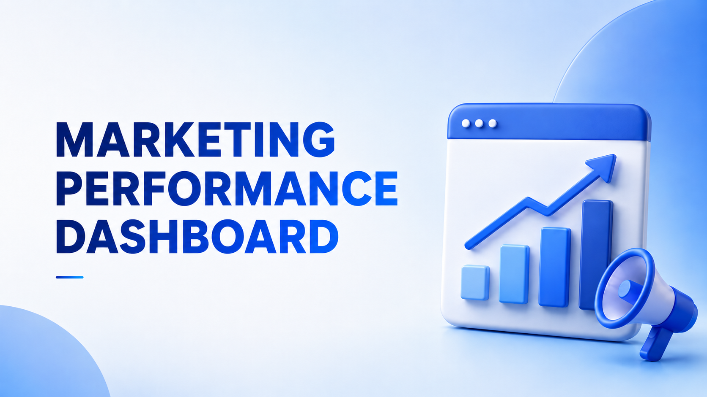

**Author:** Phan Minh Tan  
**Date:** May 2026  
**Tools Used:** Power BI, Power Query, DAX, Excel, Design Thinking

## Table of Contents
1. [📌 Background & Overview](#-background--overview)
2. [📂 Dataset Description & Data Structure](#-dataset-description--data-structure)
3. [🧠 Design Thinking Process](#-design-thinking-process)
4. [📊 Key Insights & Visualizations](#-key-insights--visualizations)
5. [🔎 Final Conclusion & Recommendation](#-final-conclusion--recommendation)

---

## 📌 Background & Overview

### Objective

This project builds a **Marketing Performance Dashboard** to help the business evaluate how effectively marketing spending generates revenue. The dashboard connects marketing cost, campaign performance, product performance, and customer-related results into one analytical view so stakeholders can make faster and more confident budget decisions.

### 📖 What is this project about?

The project focuses on analyzing marketing activities from multiple perspectives:

- **Marketing ROI / ROAS:** Understand whether marketing cost is creating measurable business value.
- **Campaign Performance:** Compare campaigns by revenue, cost, ROI, ROAS, and efficiency.
- **Channel & Funnel Performance:** Track the customer journey from impression to click, conversion, and order.
- **Product Performance:** Identify which SKUs/products respond well to marketing investment.
- **Business Decision Support:** Provide actionable insights for budget reallocation, campaign optimization, and product focus.

### 👤 Who is this project for?

The main stakeholder is the **Marketing Manager / Head of Marketing**.

This stakeholder needs a dashboard to:

- Monitor overall marketing effectiveness.
- Compare campaign, channel, and product performance.
- Identify where marketing budget is being wasted.
- Understand which activities generate the highest return.
- Support weekly/monthly business reviews and budget allocation decisions.

### ❓ Business Questions

- Is marketing spend generating enough revenue and ROI?
- Which campaigns or channels are performing best?
- Which campaigns spend a lot but deliver weak results?
- Which products or SKUs respond well to marketing activities?
- Where are users dropping off in the marketing funnel?
- How should the marketing budget be reallocated to maximize revenue and reduce waste?

### 🎯 Project Outcome

The final dashboard enables stakeholders to evaluate marketing performance from a business, campaign, funnel, and product perspective.

#### Key Results

- Built a structured dashboard using a **Design Thinking approach**.
- Defined **Marketing ROI** as the Northstar Metric.
- Designed dashboard pages based on stakeholder needs and decision-making behavior.
- Created views for overview, insight, campaign analysis, product analysis, and customer analysis.
- Supported budget optimization by connecting marketing spend with revenue and ROI.

#### Outcome

The project helps the Marketing Manager make data-driven decisions, identify high-performing marketing activities, reduce inefficient spending, and improve overall marketing effectiveness.

---

## 📂 Dataset Description & Data Structure

### 📌 Data Source

- **Source:** Internal sales/order, product master, and marketing campaign datasets.
- **Format:** Excel workbook.
- **Main dataset file:** `Dataset.xlsx`.
- **Dashboard file:** `Dashboard.pbix`.
- **Modeling note:** The raw dataset does **not** include a ready-made date dimension. A custom **Dim Date** table was created in Power BI to support time-based analysis.

### 📊 Dataset Overview

The workbook contains raw business data, marketing cost data, SKU-level campaign cost data, product master data, and supporting documentation sheets.

| Worksheet | Role in Project | Records | Description |
|---|---:|---:|---|
| `order` | Fact table | 3,451 rows | Sales order transactions containing customer, product, price, quantity, cost, source, and order status information. |
| `mkt_camp_cost` | Fact table | 854 rows | Campaign-level marketing spend and advertising performance, including spend, budget, impressions, clicks, CPM, and CPC. |
| `mkt_camp_by_sku_cost` | Fact table | 3,874 rows | SKU-level campaign cost allocation and engagement performance, connecting campaigns with products/SKUs. |
| `danh sach san pham` | Dimension table | 2,250 rows | Product master list containing product codes, barcode, product name, category, brand, color, material, selling price, and cost fields. |
| `Sample Description (MKT Camp by...)` | Reference sheet | 85 rows | Sample explanation / helper sheet for understanding the campaign-by-SKU calculation logic. |
| `Data Dictionary` | Reference sheet | 38 rows | Data dictionary describing the meaning of selected fields across product, order, campaign cost, and SKU-level campaign tables. |

> Record counts exclude the header row.

### 1️⃣ Tables Used in the Analytical Model

The analytical model mainly uses **3 fact tables** and **1 product dimension table**. A custom **Dim Date** table was added during Power BI modeling.

#### Fact Tables

<strong>Table 1: Fact_Order</strong>

This table contains order-level and product-level sales transaction data. It is used to calculate revenue, order volume, product sales, customer behavior, and sales contribution.

| Column Group | Key Fields | Usage |
|---|---|---|
| Order information | `ID`, `Thời gian`, `Nguồn`, `Trạng thái`, `Lý do hủy` | Track order timing, source, and order status. |
| Customer information | `Tên khách hàng`, `Mã khách hàng`, `Cấp độ khách hàng`, `Sinh nhật`, `Thành phố`, `Quận huyện`, `Phường xã` | Support customer and location-based analysis. |
| Product information | `Sản phẩm`, `Mã sản phẩm cha`, `Tên sản phẩm cha`, `Mã sản phẩm`, `Mã vạch`, `Danh mục sản phẩm` | Connect orders to product/SKU-level performance. |
| Sales measures | `Chiết khấu`, `Giá`, `Số lượng`, `Giá vốn` | Calculate revenue, quantity sold, cost, margin, and product contribution. |

<strong>Table 2: Fact_Marketing_Campaign_Cost</strong>

This table contains campaign-level marketing spending and advertising performance. It is used to evaluate campaign cost, reach, clicks, and high-level campaign efficiency.

| Column Group | Key Fields | Usage |
|---|---|---|
| Campaign information | `Tên chiến dịch`, `Ngày`, `Phân phối chiến dịch`, `Loại ngân sách chiến dịch` | Identify campaign, date, delivery status, and budget type. |
| Cost measures | `Số tiền đã chi tiêu`, `Ngân sách chiến dịch` | Measure campaign spend and compare against budget. |
| Advertising performance | `Lượt hiển thị`, `Click`, `CPM`, `CPC` | Analyze reach, traffic, and ad cost efficiency. |

<strong>Table 3: Fact_Marketing_SKU_Cost</strong>

This table connects marketing campaigns to product/SKU-level performance. It is used to evaluate how marketing spend is distributed across products and whether each SKU generates sufficient return.

| Column Group | Key Fields | Usage |
|---|---|---|
| Campaign information | `Tên chiến dịch`, `Ngày`, `Đơn vị tiền tệ`, `Phân phối chiến dịch`, `Loại ngân sách chiến dịch` | Track campaign activity by date and delivery status. |
| Product information | `Mã Sản phẩm`, `Tên Sản Phẩm`, `Tên Bài Chạy`, `Giá bán` | Connect campaign performance to SKUs/products. |
| Cost allocation | `Số tiền đã chi tiêu (VND)`, `Tiền đã chạy Theo Sản phẩm`, `Ngân sách Theo sản phẩm` | Allocate marketing cost to SKU/product level. |
| Engagement measures | `Lần bắt đầu cuộc trò chuyện qua tin nhắn`, `Bình luận về bài viết`, `Tin nhắn mới`, `Inbox Theo AM`, `Comments Theo AM` | Measure engagement and customer response. |
| Advertising performance | `Lượt hiển thị`, `Click`, `CPM`, `CPC`, `CTR`, `Lượt hiển thị Theo AM` | Analyze funnel and ad efficiency at SKU level. |
| Sales-related fields | `SL bán tổng`, `SL bán được phân bổ theo tỉ lệ`, `SL tồn`, `Tổng SL bán theo Campaign` | Support product contribution and inventory/sales context. |

#### Dimension Tables

<strong>Table 4: Dim_Product</strong>

This table contains product master data used for SKU, category, and product-level analysis.

| Column Group | Key Fields | Usage |
|---|---|---|
| Product identifiers | `ID`, `Mã vạch`, `Mã sản phẩm` | Join products across orders and marketing data. |
| Product attributes | `Loại sản phẩm`, `Tên sản phẩm`, `Danh mục`, `Mã danh mục nội bộ`, `Thương hiệu`, `Màu sắc`, `Chất liệu` | Analyze performance by product, SKU, category, and attributes. |
| Price and cost information | `Giá nhập`, `Giá bán`, `Giá bán + VAT`, `Giá vốn` | Support revenue, cost, and ROI calculations. |
| Product status | `Trạng thái` | Filter active/new products when needed. |

<strong>Table 5: Dim_Date</strong>

This table was created in Power BI during data modeling. It was not included as a raw sheet in the Excel file.

| Column Group | Description |
|---|---|
| Date fields | Date, year, quarter, month, week, day |
| Purpose | Enables trend analysis, date filtering, month-over-month comparison, and time intelligence calculations. |

### 2️⃣ Data Relationships

The model connects sales, marketing cost, campaign, SKU, product, and date information to analyze the relationship between marketing investment and business outcomes.

| From Table | To Table | Join Key | Purpose |
|---|---|---|---|
| `Fact_Order` | `Dim_Product` | Product Code / SKU | Analyze revenue, quantity sold, and product performance by SKU. |
| `Fact_Marketing_SKU_Cost` | `Dim_Product` | Product Code / SKU | Analyze marketing cost, ROAS, and ROI by product/SKU. |
| `Fact_Marketing_Campaign_Cost` | `Fact_Marketing_SKU_Cost` | Campaign Name + Date | Compare campaign-level performance with SKU-level campaign allocation. |
| `Fact_Order` | `Dim_Date` | Order Date | Analyze revenue, orders, and sales trends over time. |
| `Fact_Marketing_Campaign_Cost` | `Dim_Date` | Campaign Date | Analyze campaign spend, impressions, clicks, CPM, and CPC over time. |
| `Fact_Marketing_SKU_Cost` | `Dim_Date` | Campaign Date | Analyze SKU-level marketing performance over time. |

### 3️⃣ Main Measure Groups

| Measure Group | Example Metrics | Business Purpose |
|---|---|---|
| Revenue & Sales | Total Revenue, ASD Revenue, Direct Revenue, Total Orders, Units Sold | Understand business outcome and sales contribution. |
| Marketing Cost | Total Marketing Cost, Campaign Cost, Product Marketing Cost | Track how much budget is spent and where it is allocated. |
| Efficiency & Return | Marketing ROI, Campaign ROI, Product ROI, ROAS | Evaluate whether marketing spending is generating enough return. |
| Funnel Performance | Impressions, Clicks, CTR, Conversions, Conversion Rate, Drop-off Rate | Identify where users drop off and why performance changes. |
| Product Performance | Revenue by SKU, Units Sold by SKU, Product ROAS, SKU Cost | Identify high-performing and underperforming products. |
| Customer Context | Customer Level, City, District, Source | Understand customer segments and order distribution. |

---

## 🧠 Design Thinking Process

The dashboard was developed using the Design Thinking framework to ensure the final solution focuses on stakeholder needs and supports real business decisions.

### 1️⃣ Empathize

The Empathize stage identifies who the dashboard is for, what problems the stakeholder faces, and how the dashboard can support decision-making.

#### 5W1H

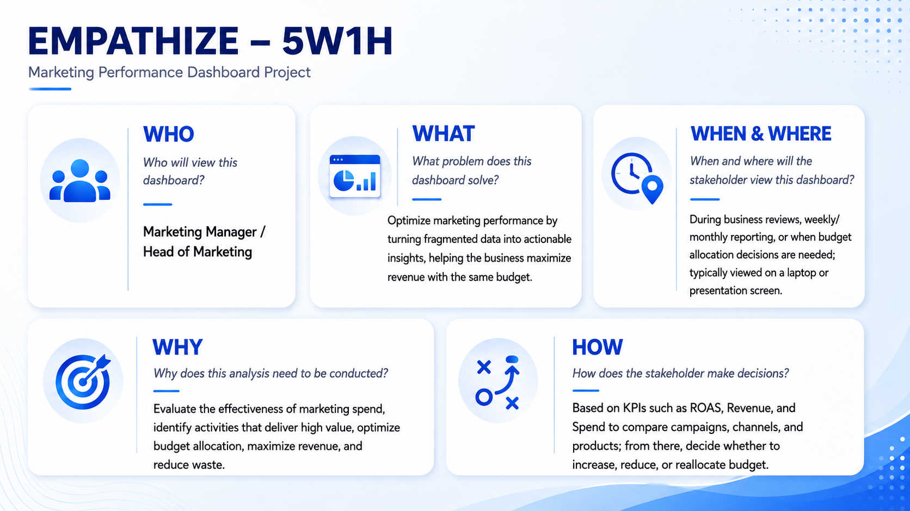

#### Empathy Map

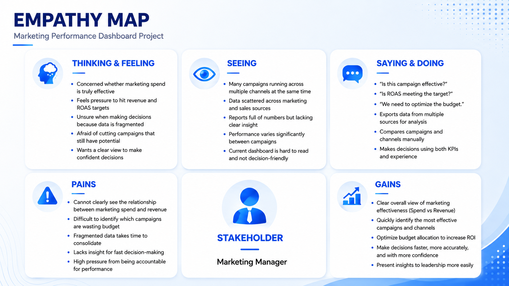

#### Stakeholder Journey

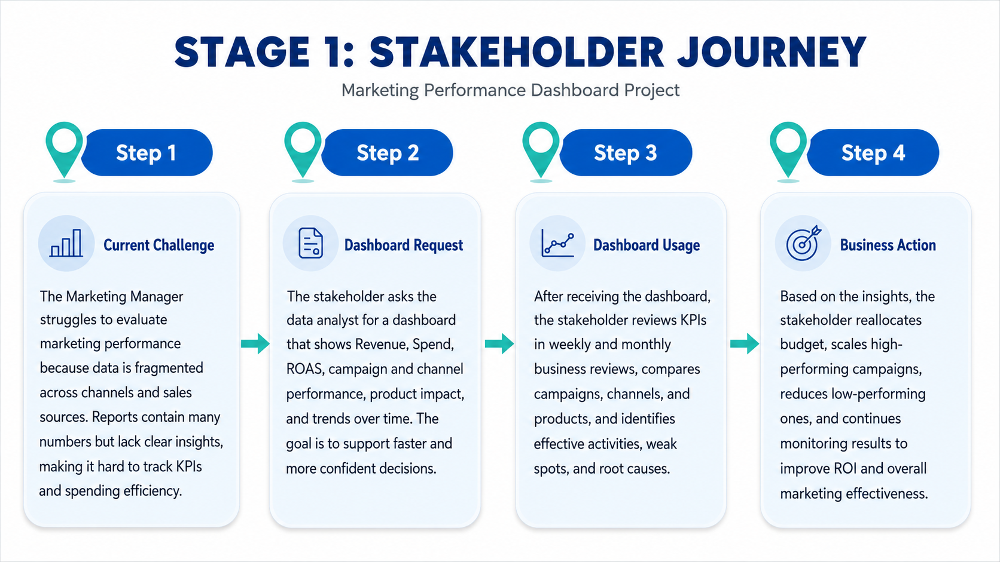

### 2️⃣ Define Point of View

This stage defines the most important business metric and the main perspectives that the stakeholder needs to observe.

#### Northstar Metric

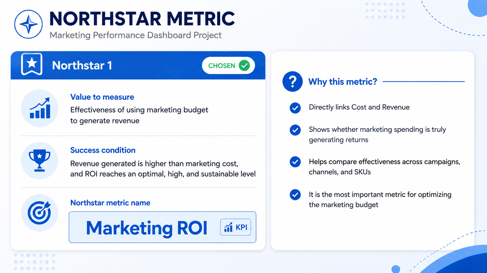

The selected Northstar Metric is **Marketing ROI** because it directly connects marketing cost with revenue and helps evaluate whether marketing investment is creating business value.

#### Define Point of View

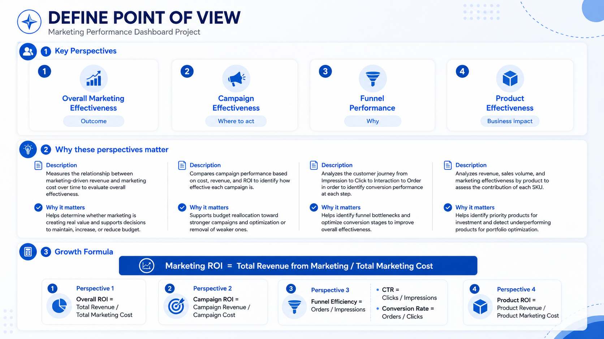

The dashboard is designed around four key perspectives:

1. **Overall Marketing Effectiveness** – Measures the outcome of marketing investment.
2. **Campaign Effectiveness** – Identifies where to act and which campaigns should be optimized.
3. **Funnel Performance** – Explains why performance changes by analyzing conversion stages.
4. **Product Effectiveness** – Evaluates business impact by SKU/product.

### 3️⃣ Ideate

The Ideate stage brainstorms dashboard content and organizes dashboard pages by information priority.

#### Brainstorming

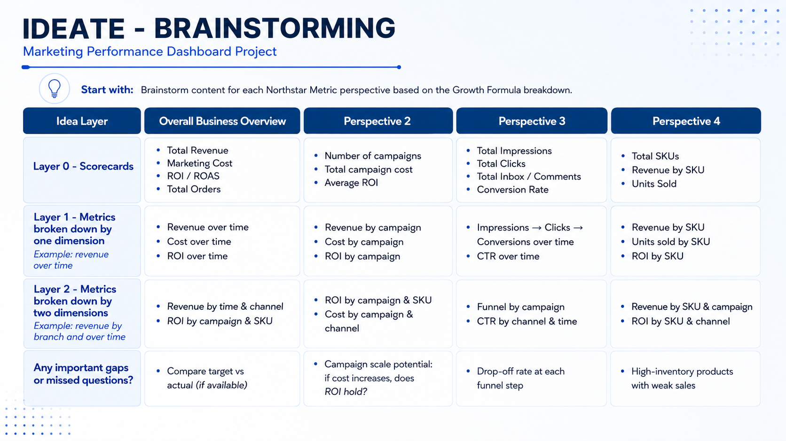

#### Structure Idea

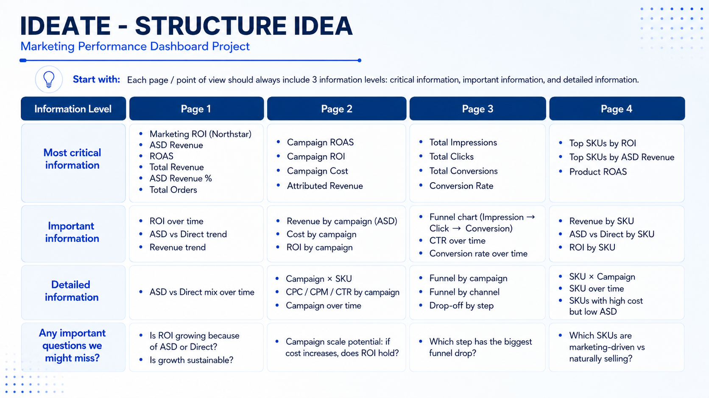

### 4️⃣ Prototype and Review

The Prototype and Review stages are reflected in the Power BI dashboard pages. The dashboard was structured to move from high-level overview to detailed analysis so stakeholders can quickly detect issues, drill into causes, and take action.

---

## 📊 Key Insights & Visualizations

### 🔍 Dashboard Preview

### 📋 I. Overview Page

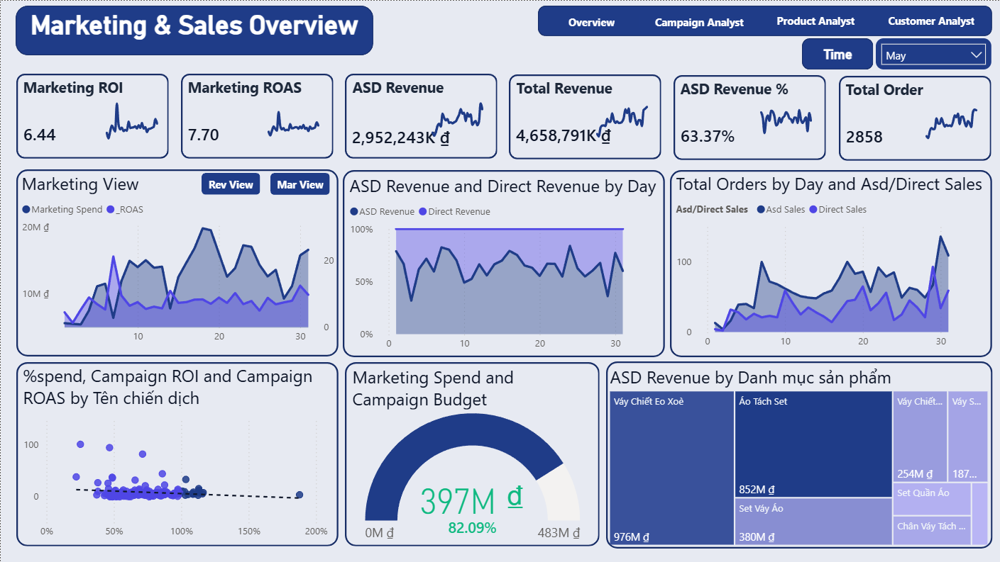

#### Key Findings

- **Marketing ROI** is used as the main executive metric because it links marketing cost directly with revenue.
- The page gives stakeholders a quick view of whether marketing spend is generating enough return.
- Revenue, marketing cost, ROAS, and total orders are combined to evaluate overall marketing effectiveness.
- Time-based trends help identify whether performance growth is stable or driven by short-term spikes.
- Comparing **ASD Revenue** and **Direct Revenue** helps separate marketing-driven impact from non-marketing sales contribution.

### 📌 II. Insight Page

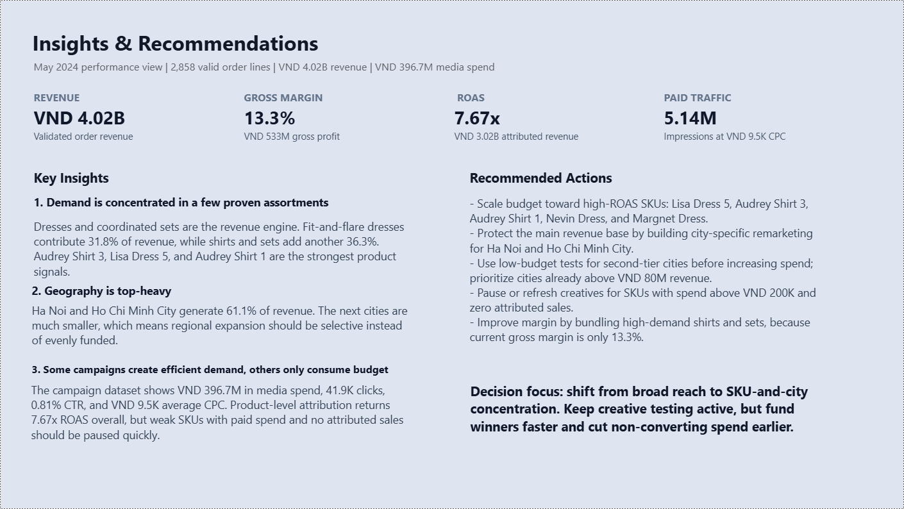

#### Key Findings

- The page summarizes the most important performance signals that require stakeholder attention.
- It helps identify where marketing budget may be inefficient by comparing cost, revenue, and ROI outcomes.
- The insight view supports faster decision-making by turning multiple dashboard metrics into action-oriented observations.
- It highlights whether performance changes come from campaign efficiency, product contribution, funnel conversion, or revenue mix.
- The page acts as a bridge between high-level monitoring and detailed analysis pages.

### 📣 III. Campaign Analysis Page

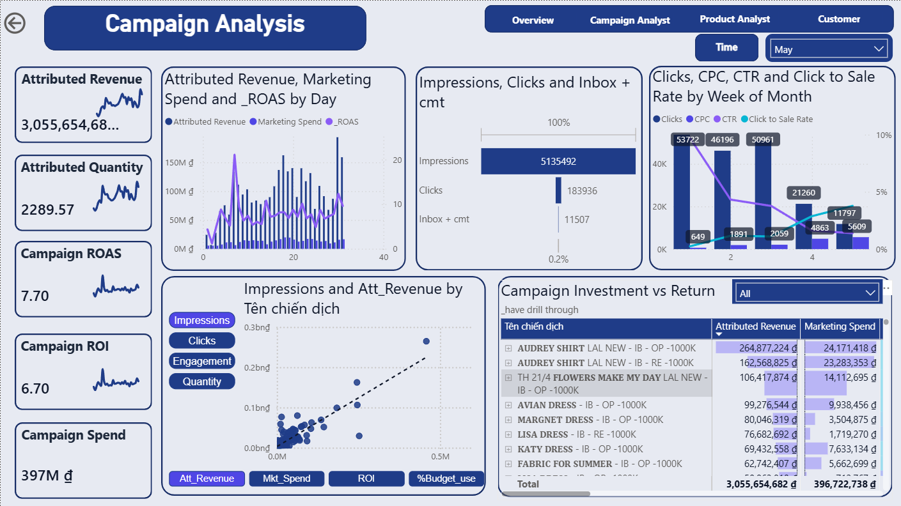

#### Key Findings

- Campaigns can be compared by **Campaign ROAS**, **Campaign ROI**, **Campaign Cost**, and **Attributed Revenue**.
- High-spend campaigns do not always produce the strongest return, so campaign efficiency must be evaluated beyond cost alone.
- The page helps identify campaigns with scaling potential by checking whether ROI remains healthy as cost increases.
- Campaign-level trends reveal which campaigns are stable, improving, or weakening over time.
- Campaign × SKU analysis helps show which products contribute most to each campaign's performance.

### 🛍️ IV. Product Analysis Page

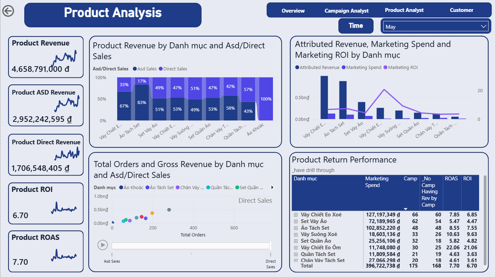

#### Key Findings

- Product performance is evaluated through **Product ROAS**, **Product ROI**, revenue by SKU, and units sold by SKU.
- The page helps identify SKUs that respond well to marketing investment and should be prioritized for future campaigns.
- Products with high marketing cost but low ASD revenue can be detected for further review.
- Comparing ASD-driven sales with direct sales helps determine which SKUs are marketing-driven versus naturally selling.
- SKU × Campaign analysis supports better product selection for future campaign planning.

### 👥 V. Customer Analysis Page

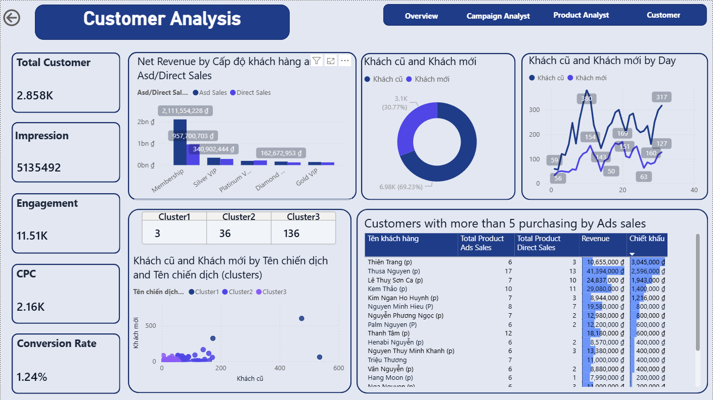

#### Key Findings

- Customer-related analysis helps understand where orders come from and how customer groups contribute to performance.
- Customer level, source, and location fields provide context for segmentation and targeting decisions.
- The page supports deeper analysis of customer response to marketing activity and order behavior.
- Customer insights help the stakeholder connect marketing performance with actual buyer behavior.
- The results can support future campaign targeting, customer segmentation, and retention strategy.

---

## 🔎 Final Conclusion & Recommendation

| Aspect | Insight | Recommendation |
|---|---|---|
| Overall Marketing Effectiveness | Marketing performance should be evaluated by connecting marketing cost with revenue and ROI, rather than looking at spend alone. | Use **Marketing ROI** as the main decision metric for business reviews and budget planning. |
| Campaign Performance | Campaigns can differ significantly in cost efficiency and revenue contribution. Some campaigns may consume budget without generating proportional returns. | Increase investment in high-ROI campaigns and review or reduce budget for campaigns with weak ROI/ROAS. |
| Funnel Performance | Funnel metrics help explain where performance is lost between impressions, clicks, conversions, and orders. | Track CTR, conversion rate, and drop-off points to improve ad messaging, targeting, and the customer journey. |
| Product Performance | Some SKUs may respond better to marketing investment, while others may have high cost but low sales contribution. | Prioritize products with strong ROI and revenue contribution; investigate products with high marketing cost and weak sales. |
| Customer Understanding | Customer fields provide useful context for source, customer level, and location-based behavior. | Use customer segmentation to improve targeting and connect marketing performance with buyer behavior. |
| Budget Allocation | Without a centralized dashboard, stakeholders may rely on fragmented reports and manual comparison. | Reallocate budget based on ROI, campaign performance, product performance, and funnel efficiency. |

### Final Recommendation

The business should use the **Marketing Performance Dashboard** as a recurring decision-support tool in weekly and monthly reviews. By monitoring Marketing ROI, campaign efficiency, funnel conversion, product-level performance, and customer behavior, the Marketing Manager can optimize budget allocation, reduce wasted spend, and improve overall marketing outcomes.

---

## 👤 Author

**Phan Minh Tan**

Aspiring Data Analyst with interests in Power BI, SQL, Python, data visualization, and business analytics.
